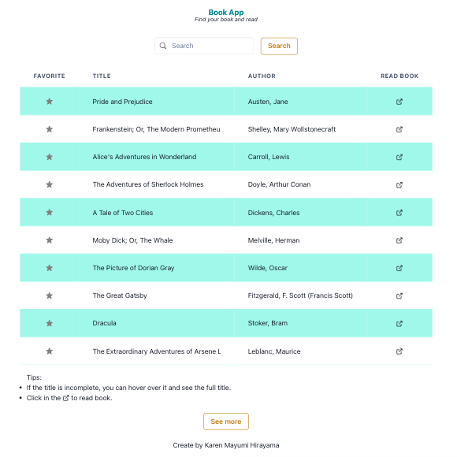
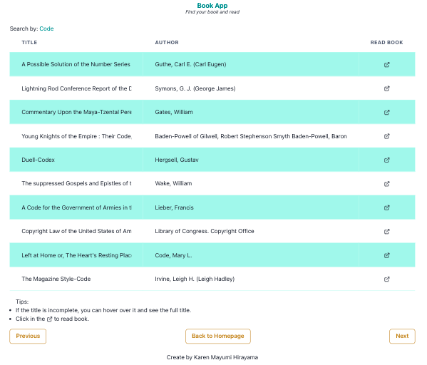

# Book App - Find and read book

The project is build with [Project Gutenberg Api Root](https://gnikdroy.pythonanywhere.com/api/) to display books.

## Tecnologies

This project is build with:

[ReactJS](https://pt-br.reactjs.org/)
[Redux](https://redux.js.org/)
[Axios](https://axios-http.com/docs/intro)
[Chakra](https://chakra-ui.com/)

## User Story

A user can view the book list, favorite books, search for and read the book.
### Homepage

</img>

The button "SEE MORE" load more books.

### Search results page

</img>

The page displays the results of the user's search.

### Not found page

</img>

If the fetch data fails or the search in the API fails, the user will be directed to a not found page.
## Start the application

To run the application, first make sure you have [npm](https://www.npmjs.com/) or [yarn](https://yarnpkg.com/). The follow steps are with yarn, but it works with npm.

### `yarn install`

Run in the terminal `yarn install` to install `node-modules`.

### `yarn start`

After run in the terminal `yarn start`, and open [http://localhost:3000](http://localhost:3000) to view it in the browser.